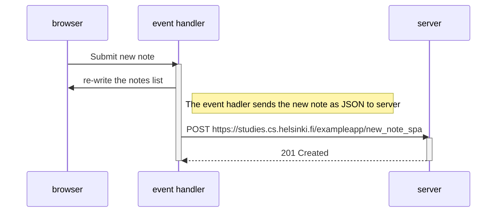

```mermaid

sequenceDiagram
    participant browser
    participant event handler
    participant server
   
    browser->>event handler: Submit new note
    activate event handler
    event handler->>browser: re-write the notes list

    Note right of event handler : The event hadler sends the new note as JSON to server

    event handler->>server: POST https://studies.cs.helsinki.fi/exampleapp/new_note_spa
    activate server
    server-->>event handler: 201 Created
    deactivate server
    deactivate event handler

```

